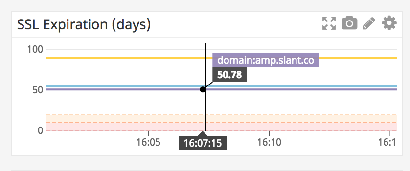

# Datadog

Use the following annotations in the certmanager-metrics deployment to have Datadog's autodiscovery gather metrics, and rename them into their general conventions:

```yaml
spec:
  template:
    metadata:
      annotations:
        ad.datadoghq.com/certmanager-metrics.check_names: '["prometheus"]'
        ad.datadoghq.com/certmanager-metrics.init_configs: '[{}]'
        ad.datadoghq.com/certmanager-metrics.instances: >
          [
            {
              "prometheus_url": "http://%%host%%:10254/metrics",
              "namespace": "kubernetes",
              "metrics": [
                {"kubernetes_certmanager_certificate_expires_seconds": "certmanager.certificate.expires.seconds"}
              ]
            }
          ]
```


## Certificate Expiration



```json
{
  "status": "done",
  "autoscale": true,
  "yaxis": {
    "min": "0"
  },
  "markers": [
    {
      "max": 10,
      "type": "error dashed",
      "value": "0 < y < 10",
      "min": 0,
      "dim": "y"
    },
    {
      "max": 20,
      "type": "warning dashed",
      "value": "10 < y < 20",
      "min": 10,
      "dim": "y"
    }
  ],
  "viz": "timeseries",
  "requests": [
    {
      "q": "avg:kubernetes.certmanager.certificate.expires.seconds{*} by {domain}/86400",
      "type": "line",
      "style": {
        "palette": "dog_classic",
        "type": "solid",
        "width": "normal"
      },
      "conditional_formats": [],
      "aggregator": "avg"
    }
  ]
}
```
